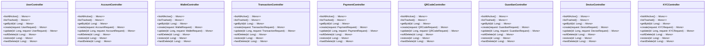

```mermaid
classDiagram
%% CONTROLLERS QRbank COM DTOs

    class UserController {
        +listAllActive() : Mono<ResponseEntity<List<UserResponse>>>
        +listTrashed() : Mono<ResponseEntity<List<UserResponse>>>
        +getById(id: Long) : Mono<ResponseEntity<UserResponse>>
        +create(request: UserRequest) : Mono<ResponseEntity<UserResponse>>
        +update(id: Long, request: UserRequest) : Mono<ResponseEntity<UserResponse>>
        +softDelete(id: Long) : Mono<ResponseEntity<Void>>
        +restore(id: Long) : Mono<ResponseEntity<Void>>
        +hardDelete(id: Long) : Mono<ResponseEntity<Void>>
    }

    class AccountController {
        +listAllActive() : Mono<ResponseEntity<List<AccountResponse>>>
        +listTrashed() : Mono<ResponseEntity<List<AccountResponse>>>
        +getById(id: Long) : Mono<ResponseEntity<AccountResponse>>
        +create(request: AccountRequest) : Mono<ResponseEntity<AccountResponse>>
        +update(id: Long, request: AccountRequest) : Mono<ResponseEntity<AccountResponse>>
        +softDelete(id: Long) : Mono<ResponseEntity<Void>>
        +restore(id: Long) : Mono<ResponseEntity<Void>>
        +hardDelete(id: Long) : Mono<ResponseEntity<Void>>
    }

    class WalletController {
        +listAllActive() : Mono<ResponseEntity<List<WalletResponse>>>
        +listTrashed() : Mono<ResponseEntity<List<WalletResponse>>>
        +getById(id: Long) : Mono<ResponseEntity<WalletResponse>>
        +create(request: WalletRequest) : Mono<ResponseEntity<WalletResponse>>
        +update(id: Long, request: WalletRequest) : Mono<ResponseEntity<WalletResponse>>
        +softDelete(id: Long) : Mono<ResponseEntity<Void>>
        +restore(id: Long) : Mono<ResponseEntity<Void>>
        +hardDelete(id: Long) : Mono<ResponseEntity<Void>>
    }

    class TransactionController {
        +listAllActive() : Mono<ResponseEntity<List<TransactionResponse>>>
        +listTrashed() : Mono<ResponseEntity<List<TransactionResponse>>>
        +getById(id: Long) : Mono<ResponseEntity<TransactionResponse>>
        +create(request: TransactionRequest) : Mono<ResponseEntity<TransactionResponse>>
        +update(id: Long, request: TransactionRequest) : Mono<ResponseEntity<TransactionResponse>>
        +softDelete(id: Long) : Mono<ResponseEntity<Void>>
        +restore(id: Long) : Mono<ResponseEntity<Void>>
        +hardDelete(id: Long) : Mono<ResponseEntity<Void>>
    }

    class PaymentController {
        +listAllActive() : Mono<ResponseEntity<List<PaymentResponse>>>
        +listTrashed() : Mono<ResponseEntity<List<PaymentResponse>>>
        +getById(id: Long) : Mono<ResponseEntity<PaymentResponse>>
        +create(request: PaymentRequest) : Mono<ResponseEntity<PaymentResponse>>
        +update(id: Long, request: PaymentRequest) : Mono<ResponseEntity<PaymentResponse>>
        +softDelete(id: Long) : Mono<ResponseEntity<Void>>
        +restore(id: Long) : Mono<ResponseEntity<Void>>
        +hardDelete(id: Long) : Mono<ResponseEntity<Void>>
    }

    class QRCodeController {
        +listAllActive() : Mono<ResponseEntity<List<QRCodeResponse>>>
        +listTrashed() : Mono<ResponseEntity<List<QRCodeResponse>>>
        +getById(id: Long) : Mono<ResponseEntity<QRCodeResponse>>
        +create(request: QRCodeRequest) : Mono<ResponseEntity<QRCodeResponse>>
        +update(id: Long, request: QRCodeRequest) : Mono<ResponseEntity<QRCodeResponse>>
        +softDelete(id: Long) : Mono<ResponseEntity<Void>>
        +restore(id: Long) : Mono<ResponseEntity<Void>>
        +hardDelete(id: Long) : Mono<ResponseEntity<Void>>
    }

    class GuardianController {
        +listAllActive() : Mono<ResponseEntity<List<GuardianResponse>>>
        +listTrashed() : Mono<ResponseEntity<List<GuardianResponse>>>
        +getById(id: Long) : Mono<ResponseEntity<GuardianResponse>>
        +create(request: GuardianRequest) : Mono<ResponseEntity<GuardianResponse>>
        +update(id: Long, request: GuardianRequest) : Mono<ResponseEntity<GuardianResponse>>
        +softDelete(id: Long) : Mono<ResponseEntity<Void>>
        +restore(id: Long) : Mono<ResponseEntity<Void>>
        +hardDelete(id: Long) : Mono<ResponseEntity<Void>>
    }

    class DeviceController {
        +listAllActive() : Mono<ResponseEntity<List<DeviceResponse>>>
        +listTrashed() : Mono<ResponseEntity<List<DeviceResponse>>>
        +getById(id: Long) : Mono<ResponseEntity<DeviceResponse>>
        +create(request: DeviceRequest) : Mono<ResponseEntity<DeviceResponse>>
        +update(id: Long, request: DeviceRequest) : Mono<ResponseEntity<DeviceResponse>>
        +softDelete(id: Long) : Mono<ResponseEntity<Void>>
        +restore(id: Long) : Mono<ResponseEntity<Void>>
        +hardDelete(id: Long) : Mono<ResponseEntity<Void>>
    }

    class KYCController {
        +listAllActive() : Mono<ResponseEntity<List<KYCResponse>>>
        +listTrashed() : Mono<ResponseEntity<List<KYCResponse>>>
        +getById(id: Long) : Mono<ResponseEntity<KYCResponse>>
        +create(request: KYCRequest) : Mono<ResponseEntity<KYCResponse>>
        +update(id: Long, request: KYCRequest) : Mono<ResponseEntity<KYCResponse>>
        +softDelete(id: Long) : Mono<ResponseEntity<Void>>
        +restore(id: Long) : Mono<ResponseEntity<Void>>
        +hardDelete(id: Long) : Mono<ResponseEntity<Void>>
    }
```